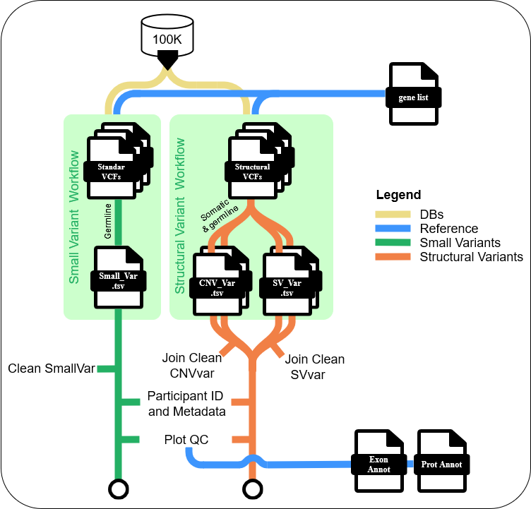

# DHX34 & DDX41 Bioinformatics Project

## Overview
Nextflow-based pipeline for analyzing germline variants in DHX34 and DDX41 genes associated with hematological neoplasm predisposition. Integrates variant annotation, quality control, clinical data, and automated reporting for large-scale WGS analysis.

## Key Features

### Core Capabilities
- **Variant Processing**: Automated handling of small variants (SNVs/indels) and structural variants (CNVs/SVs)
- **Multi-Gene Support**: Simultaneous processing of multiple genes from input lists
- **Clinical Integration**: LabKey database queries for patient metadata and disease stratification
- **BCI Cohort Analysis**: Cross-cohort comparison between BCI patients and Genomics England data

### Automated Reporting
- **Quarto Reports**: Per-gene HTML reports with variant statistics, interactive plots, and QC metrics
- **Pipeline Metrics**: Execution timeline, resource usage, DAG visualization, and detailed trace files
- **Publication-Ready**: High-quality graphics suitable for manuscripts

### Technical Features
- **Containerized**: Singularity/Docker containers for reproducibility
- **Modular Design**: Organized subworkflows for different variant types
- **Multi-Environment**: Profile-based configuration (TRE, HPC, local)

## Pipeline Architecture

## Project Structure
- `main.nf`, `nextflow.config`: Main Nextflow pipeline and configuration.
- `bin/`: R scripts for data cleaning and plotting.
- `data/`: Input data, including raw and processed files.
- `results/`: Output results and plots.
- `modules/`, `subworkflows/`: Modular Nextflow components.
- `docs/`: Documentation and project presentations.

